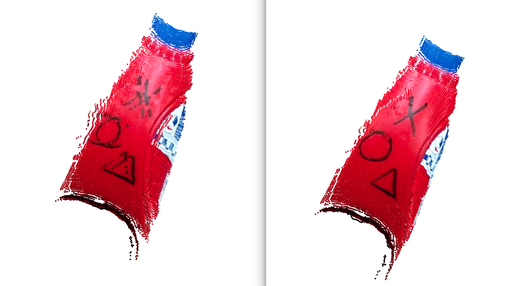

# 3D Scanner

### A pipeline for online 3D reconstruction of objects only using visual data from RGB-D camera (Kinect V2).

**Miaoding Dai**
> Winter Project in MSR, Northwestern University (Winter 2018)

_A simple demo of 3D reconstruction of a sneaker 'Kyrie4 CNY' with this pipeline. More examples see 'Demo' part._

## Introduction

The goal of this project is to develop a pipeline that can do online 3D reconstruction of small scale obejects, only using visual data from RGB-D camera.

While some commercial 3D scanner can provide with more acurate reconstruction results, they have some disadvantages. Some of them are very expensive, some of them have no colors (laser scan), and some of them are limited only to be used in some particular environments with special setup.

In this project, I explored to only use visual data (color images and range images), to robustly and conveniently reconstruct objects online, which seems a more natural and smarter way for a robot to explore the world.

## Pipeline Flow

#### Overview
I used a [Kinect V2](https://www.xbox.com/en-US/xbox-one/accessories/kinect) as the RGB-D camera for my pipeline, and use [ROS](http://www.ros.org/) framework to allow communication between hardware and software, as well as different programs.

I used ROS package [iai_kinect2](https://github.com/code-iai/iai_kinect2) to do registration of range image and color image, and generate raw point cloud as input data of this 3D reconstruction pipeline.

The pipeline is divided into three major parts. I used [PCL](http://pointclouds.org/) to preprocessing raw point cloud and visualize registration process. For registration part, I used [Open3D](http://www.open3d.org/).

#### Colored ICP
Open3D is a brand new library for 3D data processing, which was just released in Jan 2018. The reason I used this library for point cloud registration is that they implemented the state-of-the-art *Colored ICP* algorithm.

> [Park2017] J. Park, Q.-Y. Zhou, and V. Koltun, Colored Point Cloud Registration Revisited, ICCV, 2017.

The image above showed how effective this algorithm is. The left only used ICP with normal info of each points, while the right image first used Normal ICP for rough registration, plus Colored ICP for refinement. For some objects with rich textures on surface, with color information synthesized, this algorithm would be super powerful.

